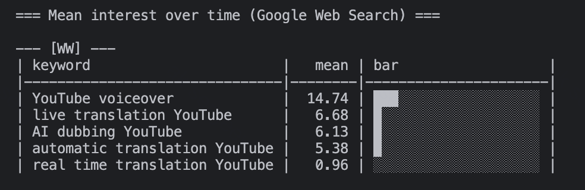

# 🚀 Trends Checker

**A powerful CLI tool to analyze Google Trends interest for YouTube search terms**

Built specifically for validating demand around real-time YouTube translation, multi-voice dubbing, and AI voiceover technologies. Uses the unofficial pytrends client for fast trend analysis.



<sub><i>Generated with: `trends-checker --cookie-file cookie.txt --geo US --timeframe "today 12-m" --display "vertical"`<br/>
(Create your own `cookie.txt` file following the instructions below)</i></sub>

---

## ⚡ Quick Start

### Requirements
- **Python 3.11+**

### Recommended Installation
```bash
make install
```

### Manual Installation
```bash
python -m venv .venv
source .venv/bin/activate
python -m pip install --upgrade pip
pip install -e .
```

### First Run
```bash
trends-checker
```
*Analyzes default translation/dubbing terms worldwide over the last 12 months*


---

## 🎯 Core Features

### 🌍 Multi-Region Analysis
```bash
# Global + key markets
trends-checker --geo WW,US,BR,ES,IN,ID,RU

# English-speaking countries only
trends-checker --geo US,GB,AU,CA
```

### ⏰ Flexible Timeframes
```bash
# Last 5 years for long-term trends
trends-checker --timeframe "today 5-y"

# Last week for quick pulse check
trends-checker --timeframe "now 7-d"

# Last 3 months for recent trends
trends-checker --timeframe "today 3-m"
```

### 🔍 Custom Keywords
```bash
# Your own terms (max 5 per request)
trends-checker --keywords "AI voice cloning,real time dubbing,YouTube translation"

# Load from file (one per line, # for comments)
trends-checker --keywords-file keywords.txt
```

### 📊 Display Options
```bash
# Vertical layout with ASCII progress bars
trends-checker --display vertical --geo WW,US

# Wide table format
trends-checker --display wide
```

### 💾 Data Export
```bash
# Save results to CSV
trends-checker --output trends_analysis.csv

# Include related rising queries
trends-checker --related --output comprehensive_report.csv
```

---

## 🍪 Handling 429 (Too Many Requests)

Google Trends aggressively rate-limits requests. **When you get 429 errors:**

### Quick Solutions:
- Reduce regions per run and add delays
- Use browser cookies to warm up the session
- Space out your requests over time

### Getting Browser Cookies:

**Chrome/Edge Steps:**
1. **Open** https://trends.google.com/trends/?geo=US
2. **DevTools** → **Network** → reload the page  
3. **Find request** like `explore?geo=US` (any Trends API call)
4. **Request Headers** → copy the full `Cookie` value
5. **Save to** `cookie.txt` (single line)

### Using Cookies:
```bash
# From file (recommended)
trends-checker --cookie-file cookie.txt --geo US

# Environment variable
TRENDS_COOKIE="NID=...; other=..." trends-checker --geo US

# Inline (not recommended - stays in shell history)
trends-checker --cookie "NID=...; other=..." --geo US
```

> ⚠️ **Security Note:** Browser cookies are sensitive. Don't commit them, avoid shell history, rotate after use.

---

## 📈 Usage Examples

### Basic Demand Analysis
```bash
# Global + US markets, vertical view, past year
trends-checker --display vertical --geo WW,US --timeframe "today 12-m"
```

### Comprehensive Market Research
```bash
# Custom terms + CSV export + related queries
trends-checker \
  --keywords-file my_research_terms.txt \
  --geo US,ES,BR,DE,FR \
  --related \
  --output market_analysis.csv
```

### Quick Trend Check
```bash
# Minimal run for trend signal
trends-checker --geo US --timeframe "now 7-d"
```

### Niche Analysis
```bash
# AI dubbing in English-speaking markets
trends-checker \
  --keywords "AI voice cloning,deepfake voice,synthetic speech,voice synthesis" \
  --geo US,GB,AU,CA \
  --timeframe "today 2-y" \
  --display vertical
```

### International Market Comparison
```bash
# Compare translation demand across major markets
trends-checker \
  --keywords "real time translation,live translation,auto translate" \
  --geo WW,US,CN,JP,DE,BR \
  --output international_comparison.csv
```

---

## 🎛️ Complete Parameter Reference

| Parameter | Description | Default |
|-----------|-------------|---------|
| `--keywords` | Comma-separated terms (max 5) | English translation/dubbing terms |
| `--keywords-file` | File with keywords (one per line) | - |
| `--geo` | Comma-separated regions (ISO codes or WW) | WW,US,BR,ES,IN,ID,RU |
| `--timeframe` | Time period (e.g., "today 12-m", "today 5-y") | "today 12-m" |
| `--display` | Layout: `vertical` \| `wide` | vertical |
| `--output` | CSV export path | - |
| `--related` | Show rising related queries | false |
| `--sleep` | Seconds between geo requests | 1.2 |
| `--retries` | Retry attempts on errors | 3 |
| `--backoff` | Exponential backoff base (seconds) | 1.5 |
| `--jitter` | Random jitter added to delays | 0.6 |
| `--cookie-file` | File containing browser cookie | - |
| `--cookie` | Raw cookie header value | - |
| `--proxy` | HTTP/HTTPS proxy URLs (comma-separated) | - |
| `--hl` | UI language (e.g., en-US, es-ES) | en-US |

---

## 🛠️ Make Commands

```bash
make install     # Create venv and install dependencies
make run         # Run with default parameters
make run-related # Run with related queries enabled
make clean       # Remove caches and build artifacts
make reset       # Remove venv and clean everything
make help        # Show all available targets
```

---

## 📋 How It Works

### What Gets Analyzed:
- **YouTube Search only** (`gprop=youtube`) - not web search
- **Up to 5 keywords** per request (Google's limit)
- **Mean interest** per keyword per region over timeframe
- **Related rising queries** (optional, slower)

### Output Formats:
- **Vertical** - Per-region blocks with ASCII progress bars and sorted results (default)
- **Wide** - Compact table with all regions as columns

### Data Points:
- Interest scores are **relative** (0-100 scale)
- Values represent **average interest** over the time period
- **100 = peak popularity** for that term in that region/timeframe

---

## 🚨 Troubleshooting

### Common Issues:

**❌ 429 Too Many Requests**
```bash
# Reduce load
trends-checker --geo US --sleep 2.0 --retries 1

# Use authenticated session
trends-checker --cookie-file cookie.txt --geo US,CA
```

**❌ No Data Returned**
```bash
# Check region codes (use ISO country codes)
trends-checker --geo US  # ✅ correct
trends-checker --geo USA # ❌ incorrect

# Try different timeframe
trends-checker --timeframe "today 3-m"  # instead of longer periods
```

**❌ Slow Performance**
```bash
# Skip related queries (they're slow)
trends-checker  # without --related flag

# Fewer regions per run
trends-checker --geo US,CA  # instead of many regions
```

**❌ Keywords Not Found**
```bash
# Check spelling and try broader terms
trends-checker --keywords "YouTube translation"  # broader
# instead of very specific terms

# Try different timeframes
trends-checker --timeframe "today 5-y"  # longer history
```

---

## 💡 Pro Tips

### For Heavy Usage:
1. **Batch smartly** - Run fewer regions per call, more calls total
2. **Use delays** - Increase `--sleep` and use `--jitter` for randomization  
3. **Rotate cookies** - Fresh browser sessions help avoid limits
4. **Monitor 429s** - Back off immediately when you hit rate limits

### For Research:
1. **Start narrow** - Use `--timeframe "now 7-d"` first, then expand
2. **Compare timeframes** - Run same keywords with different periods
3. **Save everything** - Always use `--output` to build historical datasets
4. **Check related** - Use `--related` to discover new keyword opportunities

### For Monitoring:
1. **Automate runs** - Set up cron jobs with different regions/timeframes
2. **Track changes** - Compare CSV exports over time to spot trends
3. **Alert on spikes** - Build monitoring around sudden interest increases
4. **Regional insights** - Use vertical display to spot geographic patterns

### Keyword Strategy:
- **Mix broad/specific** terms to get complete picture
- **Include variations** - "AI dubbing" vs "artificial intelligence dubbing"  
- **Test seasonality** - Compare current period to same period last year
- **Language variants** - Test English terms in non-English markets

---

## 🔍 Default Keywords

The tool comes with curated default keywords focused on YouTube translation/dubbing:

- `real time translation YouTube`
- `live translation YouTube`  
- `AI dubbing YouTube`
- `YouTube voiceover`
- `automatic translation YouTube`

These terms are specifically chosen to validate demand for real-time YouTube translation technologies and AI-powered dubbing solutions.

---

## 📊 Understanding the Output

### Interest Scores:
- **0-100 scale** where 100 = peak popularity
- **Relative to timeframe and region** - not absolute numbers
- **Weekly/monthly averages** depending on timeframe selected

### Interpreting Results:
- **50+ = Strong interest** in that region/timeframe
- **20-50 = Moderate interest** worth investigating
- **<20 = Low interest** may indicate niche market
- **0 = Insufficient data** (very rare terms or regions)

---

## ⚠️ Important Limitations

1. **Unofficial API** - Google has no public Trends API; pytrends can break
2. **Rate Limiting** - Google aggressively throttles automated requests
3. **Relative Data** - All scores are relative, not absolute search volumes
4. **YouTube Only** - This tool specifically analyzes YouTube search trends
5. **Regional Variations** - Some terms may not translate well across regions

---

## 📄 Sample Keywords File

Create `keywords.txt` with your research terms:

```
# YouTube Translation Research Terms
real time translation YouTube
live translation YouTube  
AI dubbing YouTube
YouTube voiceover
automatic translation YouTube

# Voice Technology Terms  
AI voice cloning
synthetic speech
voice synthesis
deepfake voice

# Market Segments
multilingual content
international YouTube
global content creation
```

---

## ⭐ Contributing & Feedback

If this tool has helped with your YouTube trends research or market analysis:

1. **Star the repository** ⭐
2. **Share your use cases** - what markets are you researching?
3. **Report issues** - help improve the tool for everyone
4. **Suggest features** - what other trend analysis would be helpful?

---

**Happy trend hunting! ✨**

*Built for creators, researchers, and entrepreneurs validating the future of multilingual YouTube content.*