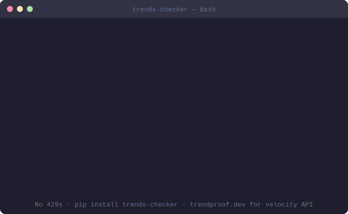

# 🚀 Trends Checker

<p align="center">
  <a href="https://github.com/akvise/trends-checker/stargazers"></a>
  
  
  
  <a href="https://github.com/akvise/trends-checker/actions/workflows/ci.yml"></a>
</p>

**Python CLI for Google Trends analysis** — with enterprise rate limiting, cookie auth, and DataForSEO backend support.

Analyze search trends across Web, YouTube, Images, News, and Shopping. Built for validating market demand, tracking keyword opportunities, and discovering trends before they peak.

<p align="center">
  
</p>

<sub><i>Generated with: <code>trends-checker --keywords "AI agents,vibe coding,cursor ide" --geo US,WW</code></i></sub>

---

## ⚡ Quick Start

```bash
pip install trends-checker

# Basic usage
trends-checker --keywords "AI agents,vibe coding" --geo US

# No 429s — use DataForSEO backend
trends-checker --keywords "AI agents,vibe coding" --dataforseo-key user@email.com:password
```

---

## 🔥 Why trends-checker?

Google Trends API is unofficial and aggressively rate-limited. One script hitting 10+ regions = 429 errors immediately.

trends-checker solves this:
- **Cookie auth** — warm up session with your browser cookies
- **Exponential backoff** — smart retry logic, configurable sleep/jitter
- **DataForSEO backend** — paid alternative, zero rate limits, real search volumes
- **Multi-region** — analyze 50+ countries in one run
- **CSV export** — build historical datasets, track changes over time

---

## 🔍 How it works

trends-checker queries the **unofficial Google Trends API** via [pytrends](https://github.com/GeneralMills/pytrends) with several reliability layers on top:

1. **Request** — sends keyword batch to Google Trends (`/explore`, `/multiline`)
2. **Cookie auth** — optionally injects browser cookies to avoid cold-start 429s
3. **Rate limiting** — configurable sleep + jitter between geo requests
4. **Retry logic** — exponential backoff on 429/503 with configurable max retries
5. **DataForSEO fallback** — swap backend entirely for zero rate limits and real search volumes

```
keywords → [cookie auth] → Google Trends API → [retry/backoff] → normalized interest (0-100)
                                                     ↕ on 429
                                            [DataForSEO backend]
```

Result is normalized interest score (0–100) per keyword per region, rendered as ASCII chart or exported to CSV.

---

## 📂 Search Categories

```bash
trends-checker --group web --keywords "AI agents,automation tools"     # Web (default)
trends-checker --group youtube --keywords "cursor ide tutorial"         # YouTube
trends-checker --group images --keywords "AI generated art"             # Images
trends-checker --group news --keywords "artificial intelligence"         # News
trends-checker --group shopping --keywords "mechanical keyboard"         # Shopping
```

---

## 🚫 Handling 429 Errors

Google Trends rate-limits automated requests. Two solutions:

### Option 1: Browser Cookies (free)

```bash
# Get your cookie from Chrome DevTools → Network → trends.google.com
trends-checker --cookie-file cookie.txt --geo US

# Or via environment variable
TRENDS_COOKIE="NID=...;" trends-checker --geo US
```

### Option 2: DataForSEO API (recommended for automation)

```bash
# Sign up at https://app.dataforseo.com (pay-per-use, ~$0.075/request)
trends-checker --keywords "vibe coding,cursor ide" --dataforseo-key login@email.com:password

# Or via environment variable
DATAFORSEO_KEY="login@email.com:password" trends-checker --keywords "AI agents"
```

DataForSEO gives you real search volumes with no rate limits — ideal for automated pipelines, cron jobs, and AI agent workflows.

---

## 🎛️ Parameters

| Parameter | Description | Default |
|-----------|-------------|---------|
| `--keywords` | Comma-separated terms (max 5) | AI agents, vibe coding, ... |
| `--keywords-file` | File with keywords (one per line) | - |
| `--group` | `web`, `youtube`, `images`, `news`, `shopping` | web |
| `--geo` | ISO country codes or WW | WW,US,BR,ES,IN,ID,RU |
| `--timeframe` | Time period (`"today 12-m"`, `"today 5-y"`) | `today 12-m` |
| `--display` | `vertical` or `wide` | vertical |
| `--output` | CSV export path | - |
| `--related` | Show rising related queries | false |
| `--sleep` | Seconds between geo requests | 1.2 |
| `--retries` | Retry attempts on 429 errors | 3 |
| `--backoff` | Exponential backoff base (seconds) | 1.5 |
| `--jitter` | Random jitter added to delays | 0.6 |
| `--cookie-file` | Browser cookie file | - |
| `--cookie` | Raw cookie header value | - |
| `--proxy` | HTTP/HTTPS proxy URLs (comma-separated) | - |
| `--dataforseo-key` | DataForSEO credentials (`user:pass`) | `$DATAFORSEO_KEY` |
| `--hl` | UI language (e.g., `en-US`) | en-US |

---

## 🚀 Want real-time keyword velocity?

**trends-checker** tells you *where* a keyword is now.

**[TrendProof](https://trendproof.dev)** tells you *how fast it's growing* — and when to publish.

```bash
# TrendProof API (for AI agents and automation)
curl -X POST https://trendproof.dev/api/analyze \
  -H "Authorization: Bearer TRND_your_key" \
  -d '{"keyword": "vibe coding"}'

# Returns: velocity +87%, direction: rising, action_hint: "publish now before peak"
```

→ **[Get your API key at trendproof.dev](https://trendproof.dev)**  
→ Or install the OpenClaw skill: `/skill install trendproof`

---

## 📈 Examples

```bash
# Market validation — last 12 months
trends-checker --keywords "AI agents,automation tools,no-code" --geo US,WW

# Quick pulse check
trends-checker --keywords "cursor ide,windsurf ide" --geo US --timeframe "now 7-d"

# Export for analysis
trends-checker --keywords "AI assistant" --geo US,GB,DE,FR --output research.csv --related

# Multi-region with DataForSEO (no 429s)
trends-checker --keywords "vibe coding,AI agents" --geo US,IN,BR --dataforseo-key user:pass
```

---

## 🛠️ Installation

```bash
# From source
git clone https://github.com/akvise/trends-checker
cd trends-checker
make install
```

---

## ⭐ Contributing

If trends-checker saved you from 429 hell — star the repo! ⭐

- Open issues for bugs or feature requests
- PRs welcome for new backends, display formats, or output options
- Share what you're tracking — market research, SEO, AI tool trends?

---

*Built for researchers, founders, and AI agent developers who need trend data without the pain.*
